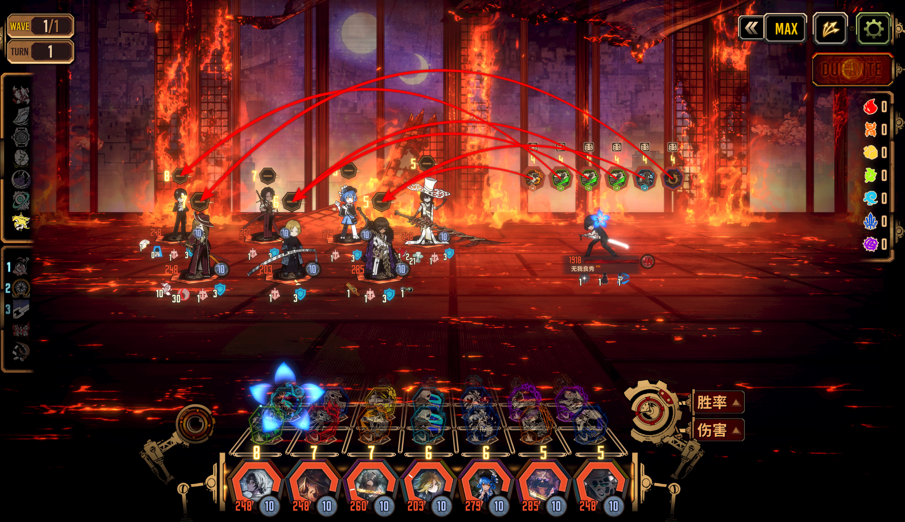

# 无我良秀遭遇战mod



## 安装

（本包使用 Lethe 1.2.4、ModularSkillScripts 5.1.7 的程序集构建，代码由codex完成，有存在史山的可能）

1. 从本仓库的 [Releases](https://github.com/LiHua5487/MugaRyoshuEncounter/releases) 下载 ZIP
2. 将其中的 `MugaRyoshuEncounter` 文件夹放到 `./LetheLauncher-Distribution-7/BepInEx/plugins/Lethe/mods`
3. 将其中的 `MugaRyoshuEncounter.dll` 放到 `./LetheLauncher-Distribution-7/BepInEx/plugins/`

安装后目录结构应为：

```text
./LetheLauncher-Distribution-7/BepInEx/plugins/
├── MugaRyoshuEncounter.dll
└── Lethe/
    └── mods/
        └── MugaRyoshuEncounter/
            ├── custom_buffs/
            ├── custom_encounters/
            ├── custom_limbus_data/
            ├── custom_limbus_locale/
            ├── custom_sprites/
            └── modular_lua/
```

## 使用说明

- 在 Lethe 自定义关卡中选择「遭遇战·无我良秀」以进入战斗
- 大厅里的 Lethe 菜单提供「无我良秀遭遇战 → 平衡版」开关，切换在下次进入关卡时生效
- 首次安装**默认开启平衡版**，可在 Lethe 菜单中关闭。配置保存在 `BepInEx/config/encounters.muga.ryoshu.cfg` 的 `[Encounter] BalancedMode`

## 平衡版调整内容

### 关卡

- 良秀、格里高尔无法编队
- 宗教层、社会层金枝被禁用

### 技能


**留痕 【忧郁/斩击/+2/■】**  
10-5-5  
可无视速度值指定本技能  
不会触发目标的守备技能  
【拼点胜利】 使自身恢复12点理智值，使本技能造成的伤害-80%  
【拼点失败】 使自身失去5点理智值，并使目标的[切丝]层数-3，且本技能不会施加[切丝]（包括被动效果）  

**涂抹 【暴食/斩击/+2/■】**  
8-4-4  
【使用时】 自身每带有10层[无我]，使本技能的最终威力+1（最多+3）  
【使用时】 目标每带有6级[流血]强度，使本技能的最终威力+1（最多+3）  
【拼点失败】 使本技能基础威力-4，造成的伤害-50%，且造成的伤害不会使目标陷入混乱  

- I：【不可摧毁硬币】【未摧毁－命中时】 施加2级[流血]强度
- II：【不可摧毁硬币】【未摧毁－命中时】 施加2级[流血]强度

**泼洒 【色欲/斩击/+4/■】**  
12-5-5-5  
与本技能拼点的技能若为基础攻击技能，其最先的硬币有50%概率被删除  
【使用时】 自身每带有10层[无我]，使本技能的最终威力+1（最多+5）  
【使用时】 目标每带有6级[流血]强度，使本技能的最终威力+1（最多+4）  
【拼点失败】 使本技能基础威力-4，造成的伤害-50%，且造成的伤害不会使目标陷入混乱  

- I：【不可摧毁硬币】【未摧毁－命中时】 施加1层[流血]
- II：【不可摧毁硬币】【未摧毁－命中时】 施加1层[流血]
- III：【不可摧毁硬币】【未摧毁－命中时】 施加2层[流血]

**抹除 【愤怒/斩击/+4/■】**  
7-3-3-3  
可无视速度值指定本技能  
与本技能拼点的技能若为基础攻击技能，其最先的硬币必定被删除  
【使用时】 与带有[切丝]的目标拼点时，拼点威力+8  
本技能造成的伤害-50%  

- I：【不可摧毁硬币】【命中时】 施加2层[切丝]与1层[流血]
- II：【不可摧毁硬币】【命中时】 施加2层[切丝]与1层[流血]
- III：【不可摧毁硬币】【命中时】 施加2层[切丝]与1层[流血]

**天杀 【傲慢/斩击/+6/■】**  
20-6-6-6-6-6  
可无视速度值指定本技能  
与本技能拼点的技能若为基础攻击技能，其最先的硬币有50%概率被删除  
【使用时】 自身每带有10层[无我]，使本技能的最终威力+1（最多+8）  
【拼点失败】 使本技能基础威力-8，造成的伤害-50%，且造成的伤害不会使目标陷入混乱  
【使用后】 结束回合  

- I：【不可摧毁硬币】【命中时】 施加2层[流血]
- II：【不可摧毁硬币】【命中时】 施加2层[流血]
- III：【不可摧毁硬币】【命中时】 施加2级[流血]强度
- IV：【不可摧毁硬币】【命中时】 施加2级[流血]强度
- V：【不可摧毁硬币】【命中时】 施加5层[切丝]

**将我抹去，也将你抹去 【愤怒/斩击/+6/■】**  
26-6-6-6-6-6  
无法改变目标  
与本技能拼点的技能若为基础攻击技能，其最先的硬币必定被删除  
【使用时】 若自身的理智值不低于-10，则使本技能基础威力-15  
【战斗开始时】 使自身获得5层[易损]  
【拼点失败】 使本技能基础威力-10，造成的伤害-50%，且造成的伤害不会使目标陷入混乱  
【拼点失败】 使自身恢复15点理智值，失去10层[无我]  
【拼点失败】 使目标失去12层[切丝]  
【使用后】 结束回合  

- I：【不可摧毁硬币】
- II：【不可摧毁硬币】
- III：【不可摧毁硬币】
- IV：【不可摧毁硬币】
- V：【不可摧毁硬币】【命中时】 消耗目标所有[切丝]，每消耗1层，追加目标体力上限4%的固定伤害

**守备技能：余白 【傲慢/闪避/-2/■】**  
10-8  
【使用时】 使本技能的基础威力+（自身的[无我]层数/10 + 目标的[切丝]层数/3）（最多+5）  

- I：【闪避成功时】 使自身恢复5点理智值（每回合最多1次）

### 被动

**无我梦中**

- 回合开始时，使自身获得层数相当于当前回合数的[无我]
- 攻击技能的硬币命中时，使自身获得1层[无我]（每回合最多5层）
- [无我]层数低于80层时，造成的伤害-（80-自身的[无我]层数）%
- 受到来自[破裂]、[烧伤]、[流血]、[沉沦]、[震颤]的伤害-50%
- 体力降低至900点以下时，上述效果的强度最多累计到30级，层数最多累计到10层

**阿鼻叫唤**

- 关卡开始时，使自身获得[天杀星刀-阿赖耶识]，并将自身理智值设为-44点
- 自身的理智值不会低于-44点
- 受到包括沉沦在内的理智伤害时，改为受到（理智伤害量/2）点的体力伤害
- 体力首次降低至900点时，本回合内体力不会因伤害降至900点以下
- 触发上述效果后的下回合开始时，改变行动模式，理智上限变为0点，将不足50层的[无我]补至50层，解除混乱并清空自身的负面状态

**支离灭裂**

- 攻击技能的最后一枚硬币命中时，对目标施加1层[切丝]
- 回合开始时，自身每带有25层[无我]，令自身施加的[切丝]额外+1层（最多+4）
- 受到攻击时，使自身受到的伤害-（自身的[无我]层数/2+目标的[切丝]层数）%（最多-50%）
- 与同一技能拼点次数不低于10次时，后续每次拼点，拼点威力+1
- 若有敌方单位的[切丝]达到15层，则使用“将我抹去，也将你抹去”，指定这些单位中体力上限最高的1名单位
- 良秀将斩断与宗教层、社会层金枝的连接

### Buff

**无我**

- 最大值：100
- 回合开始时，本效果层数每有10层，使自身获得1层攻击等级提升与1层防御等级提升

**天杀星刀-阿赖耶识**

- 攻击等级+6
- 回合开始时，本场战斗中每击杀1名敌方单位，使自身获得3层攻击等级提升（最多6层）

**切丝**

- 最大值：15
- 回合开始时，使自身增加1级[流血]强度并对自身施加1层[流血]，受到（本效果层数/3）点斩击伤害
- 受到攻击时，受到（本效果层数/5）点斩击伤害
- 战斗开始时，若装备了守备技能，使本效果层数-2
- 若该单位撤退，返场时清空本效果层数

**守护他人的决意**

- 清空自身最前面的1个混乱条
- 回合开始时，获得相当于存活友方单位数的守护（最多3层）
- 回合开始时，若自身为正理智人格，则恢复10点理智值
- 命中时，使当前持有量最低的罪孽资源数量+1（全体友方单位每回合总计最多3次）
